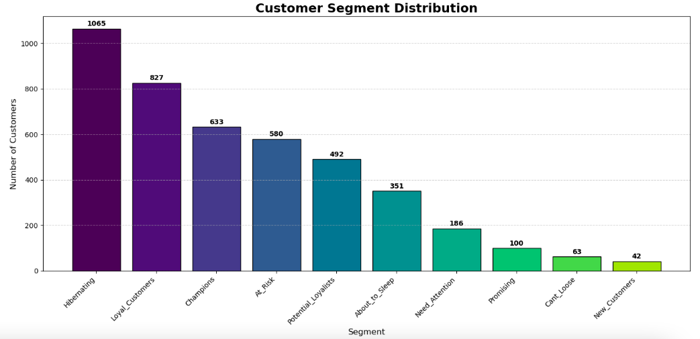

#Dataset Source : https://www.kaggle.com/datasets/fareselgohary003/online-retail-transactions-uci

# Customer Segmentation: RFM Analysis in Python

## 📌 Project Overview
This project analyzes a transactional dataset from an online retailer to segment customers into behavioral groups. Using Python, I implemented **Recency, Frequency, and Monetary (RFM)** analysis.

## 🚀 Key Features
- **Data Cleaning:** Resolved encoding issues (UTF-8-SIG) and handled missing values.
- **Scoring:** Created a 1-5 scoring system using quintiles.
- **Segmentation:** Defined 10 segments (Champions, At Risk, etc.) using Regex mapping.
- **Visualization:** Bar charts showing the distribution of the customer base.

## 📊 Results

*Our analysis showed that 'Champions' make up the highest revenue share despite being a smaller percentage of the count.*

## 🛠️ Tech Stack
- Python 3.13
- Pandas, Matplotlib, DateTime

## 📊 Data Source
*https://www.kaggle.com/datasets/fareselgohary003/online-retail-transactions-uci
